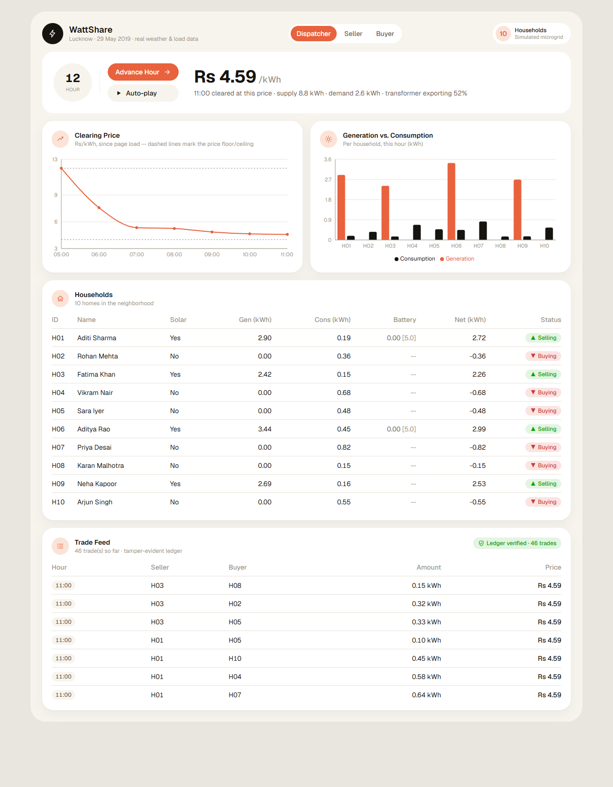
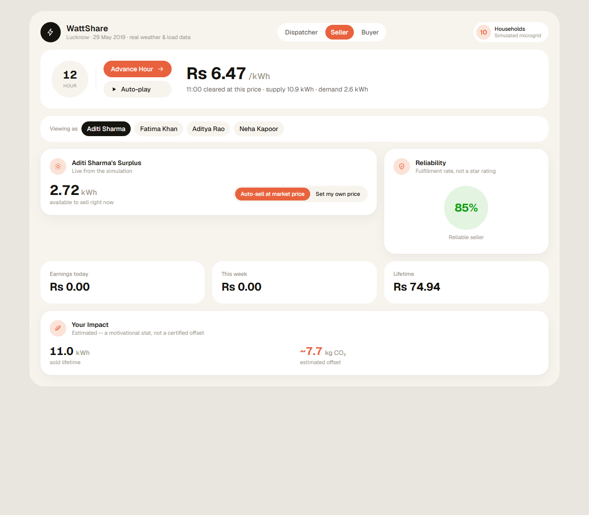
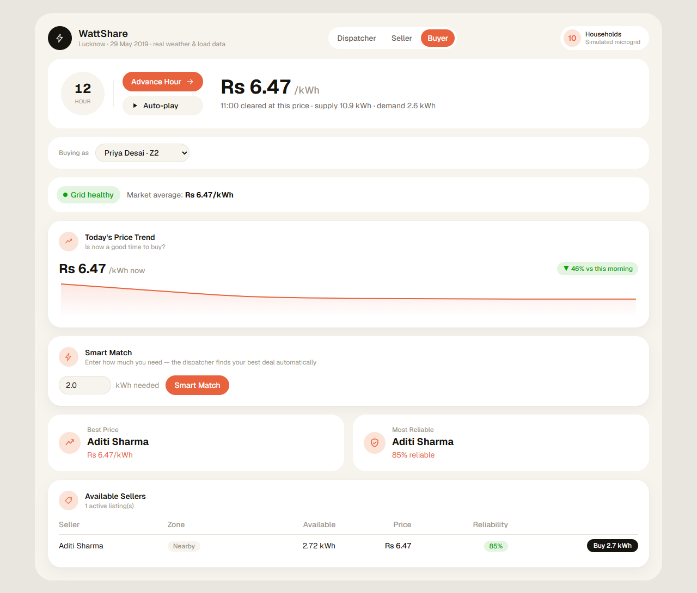

# WattShare

[](https://github.com/NavenduChaturvedi/wattshare/actions/workflows/ci.yml)

A peer-to-peer solar energy trading simulator for a residential neighborhood.
Households with rooftop solar sell surplus energy directly to nearby neighbors
instead of feeding it back to the grid at low tariffs. A dispatcher engine
matches buyers and sellers and prices trades dynamically based on local
supply and demand.

**Live demo:** [wattshare-eta.vercel.app](https://wattshare-eta.vercel.app). The
backend runs on Render's free tier, so the first load after it has been idle
can take up to a minute while the server wakes up.

| Dispatcher | Seller | Buyer |
|---|---|---|
|  |  |  |

This is a portfolio project demonstrating system design, algorithmic thinking
(matching + dynamic pricing), and full-stack delivery. All data is simulated
-- there's no real hardware, blockchain, or payment processing involved (see
[Non-goals](#non-goals)).

## How it works

**1. Household simulation, driven by real data.** By default there are 10
households, 4 with rooftop solar and 6 pure consumers, in Lucknow on
29 May 2019. Each simulated hour:
- solar generation comes from that day's **measured irradiance**
  ([Open-Meteo](https://open-meteo.com/en/docs/historical-weather-api)) run
  through a simple panel model;
- consumption follows **real smart-meter load profiles** from 38 households in
  Mathura, UP ([CEEW, CC0](https://doi.org/10.7910/DVN/GOCHJH)), for that
  season and household size, with a little per-home variation.

Every simulated day replays the configured real day. Location, date, household
count and solar ratio all live in `config/default.json`. See
[`backend/data/SOURCES.md`](backend/data/SOURCES.md) for sources, method and
caveats. The original synthetic curves are still available with
`"data_source": "synthetic"`.

**2. Matching.** Every cycle:
1. Households are split into sellers (generation > consumption this hour) and
   buyers (consumption > generation).
2. Sellers are sorted by ask price ascending (a seller's own price if their
   listing sets one, otherwise the cycle's clearing price); buyers are sorted
   by need (deficit) descending. Ties break by household id, so the same
   inputs always produce the same trades.
3. A greedy two-pointer walk pairs the cheapest seller with the neediest
   buyer for `min(seller's remaining surplus, buyer's remaining deficit)` kWh.
   Whichever side runs dry moves on to its next household, until either list
   is exhausted -- so one big seller can serve several buyers, and one big
   buyer can draw from several sellers.

This is deliberately simple (no auction, no bid prices) -- an explainable v1,
not a clearing-price auction engine. The matcher is a pure function
(`backend/market/matching.py`), and Smart Match on the buyer dashboard runs
the same function for a single buyer.

Energy traded in an hour -- by the dispatcher or on the marketplace -- is
booked against both households, so the same kWh is never sold twice and a
household can only buy up to its own deficit.

**3. Pricing.** Once per cycle, from the *aggregate* supply and demand (not
per trade):

```
clearing_price = base_price + alpha * (total_demand_kwh / total_supply_kwh)
                            + beta  * (transformer_import / transformer_capacity)^2
clamped to [price_min, price_max]
```

The constants are `base_price = 6`, `alpha = 2`, `beta = 4`, `price_min = 4`
and `price_max = 12` (Rs/kWh). They're placeholders chosen to be plausible and
easy to explain, not economically rigorous. Every trade in a cycle settles at
that cycle's single clearing price.

**4. Transformer load and grid health.** Energy traded between neighbours
stays on the local low-voltage feeder. Only the neighbourhood's net imbalance,
`|total consumption - total generation|`, crosses the distribution
transformer. Its capacity is `transformer_kw_per_home` (default 1.2 kW, an
assumption) × the number of homes.
- The quadratic `beta` term adds a congestion premium while the neighbourhood
  is **importing** from the grid. Export adds no premium: pricing local energy
  higher then would only discourage the local consumption that relieves it.
- **Grid health** (green / yellow / red at <50% / <80% / ≥80% of capacity)
  counts load in *both* directions. Heavy evening imports and heavy midday
  solar export (reverse flow) both stress the transformer.

On the default real day, the transformer runs at 55–70% importing overnight
(AC load) and up to about 70% exporting at midday, which is the classic
"duck curve".

## Architecture

```
[ Simulation Engine ] --generates--> [ Household State ]
                                              |
                                              v
                                    [ Matching Engine ]
                                              |
                                              v
                                    [ Pricing Calculator ]
                                              |
                                              v
                                    [ Trade Ledger (SQLite) ]
                                              |
                                              v
                                    [ FastAPI REST endpoints ]
                                              |
                                              v
                                    [ Next.js Dashboard ]
```

| Layer | Tech |
|---|---|
| Simulation + matching + pricing | Python 3 (stdlib only) |
| API | FastAPI + Pydantic |
| Persistence | SQLite (`sqlite3`, no ORM) |
| Frontend | Next.js (App Router) + TypeScript + Tailwind CSS |
| Charts | Recharts |

## Project layout

This was built in five phases, and each phase's entry point still works
standalone:

```
config/default.json     location, sim date, data source, household preset

backend/
  config.py             loads + validates the config (env overrides on top)
  data/                 real-data layer
    solar.py             Open-Meteo irradiance -> kWh (cached; fixture days committed)
    load.py              CEEW-derived hourly load profiles
    load_profiles.csv    the derived profiles (rebuild: build_load_profiles.py)
    SOURCES.md           provenance, licences, method
  simulation/          Phase 1 -- the neighbourhood, hour by hour
    households.py        demo preset + config-generated households
    curves.py            synthetic curves (data_source: "synthetic")
    engine.py
    models.py
  run_simulation.py     Phase 1 CLI -- prints a full simulated day to console

  market/               Phase 2 -- matching engine + dynamic pricing
    matching.py          pure greedy matcher (shared by dispatcher + Smart Match)
    pricing.py
    engine.py
    models.py
  run_market.py          Phase 2 CLI -- simulation + matching, console output

  api/                  Phase 3 -- FastAPI + SQLite
    app.py               routes
    db.py                SQLite schema + queries (raw sqlite3, no ORM)
    schemas.py           Pydantic response models
  marketplace/          listings, trade execution, reliability, seller stats
  tests/                pytest suite (unit + API smoke tests)
  display.py             shared console table printer (Phases 1 & 2)
  requirements.txt
  requirements-dev.txt   + pytest, httpx2

frontend/               Phase 4 -- Next.js dashboard
  src/
    app/                 page + layout + global styles
    components/          Controls, HouseholdTable, PriceChart, GenerationChart, TradeFeed
    lib/                 typed API client
```

## Running it locally

### Backend

Requires Python 3.11+ (CI tests 3.11 and 3.12; Render runs 3.12).

```bash
python -m venv .venv
./.venv/Scripts/activate       # macOS/Linux: source .venv/bin/activate
pip install -r backend/requirements.txt
```

Phase 1 -- household simulation only (console):
```bash
python -m backend.run_simulation --seed 42   # --seed is optional; omit for fresh randomness each run
```
Both CLIs also take `--config path.json` and `--step` (press Enter to advance
hour by hour).

Phase 2 -- adds matching + pricing (console):
```bash
python -m backend.run_market --seed 42
```

Phase 3/4 -- the API server the dashboard talks to:
```bash
uvicorn backend.api.app:app --port 8000
```
Interactive API docs: http://127.0.0.1:8000/docs

Environment overrides for the API:
- `WATTSHARE_CONFIG`: path to a config JSON (default `config/default.json`).
- `WATTSHARE_SEED`: seeds the simulation, the same as `--seed` for the CLIs.
- `WATTSHARE_DATA_SOURCE`: `real` or `synthetic`.
- `WATTSHARE_SIM_DATE`: e.g. `2019-07-11` for the cloudy monsoon fixture.
- `WATTSHARE_DB_PATH`: where the SQLite file lives (default `backend/wattshare.db`).

### Tests

```bash
pip install -r backend/requirements-dev.txt
pytest
```

GitHub Actions (`.github/workflows/ci.yml`) runs the backend suite on Python
3.11 and 3.12, and lints + builds the frontend (Node 22), on every push.

### Frontend

```bash
cd frontend
npm install
cp .env.example .env.local   # NEXT_PUBLIC_API_URL, defaults to http://127.0.0.1:8000
npm run dev
```

Open http://localhost:3000 with the backend running. Each simulated hour runs in two phases:
- **While the hour is open,** the marketplace trades. Sellers list surplus, and
  buyers buy from listings or use Smart Match.
- **Advance Hour** closes the hour. The dispatcher clears whatever surplus and
  deficit is left, at that hour's clearing price, and then the next hour opens.

**Auto-play** repeats this continuously.

## API reference

| Endpoint | Method | Description |
|---|---|---|
| `/households` | GET | Current state of all households |
| `/simulation` | GET | The hour currently open for trading |
| `/ledger/verify` | GET | Re-walk the trade hash chain; reports the first broken trade |
| `/simulate/tick` | POST | Advance the simulation by one hour |
| `/match` | POST | Run one matching cycle at the current hour |
| `/trades` | GET | Full trade history |
| `/market-state` | GET | Latest clearing price / supply / demand snapshot |
| `/market/summary` | GET | Current price, listing average/best, grid health, price trend |
| `/config` | GET | Data provenance: location, date, season, sources |
| `/listings` | POST / GET | Seller creates/updates a listing / active listings for buyers |
| `/listings/{seller_id}` | GET | A seller's current listing |
| `/listings/{id}/buy` | POST | Buy from one listing (capped at the buyer's deficit) |
| `/match/smart` | POST | Buyer-initiated match for a desired kWh |
| `/sellers/{id}/stats` | GET | Reliability + earnings |

The database resets on every server start, so the in-memory simulation clock
and the persisted trade history always stay consistent with each other.

## Deployment

**Backend -> Render.** `render.yaml` at the repo root is a ready-to-use
Blueprint:
- build: `pip install -r backend/requirements.txt`
- start: `uvicorn backend.api.app:app --host 0.0.0.0 --port $PORT`
- health check: `/config`

Connect the repo as a Blueprint, and Render will ask for
`WATTSHARE_CORS_ORIGINS`. Set it to your Vercel URL once you have one; leave
it empty to allow any origin.

**Frontend -> Vercel.** Import the repo, set the project's **Root Directory**
to `frontend`, and set `NEXT_PUBLIC_API_URL` to your Render URL in the
project's environment variables. The variable is inlined at build time, so
redeploy after changing it.

Things to know about Render's free tier:
- **Cold starts.** The service sleeps after about 15 minutes idle, and the
  first request can take up to a minute. The dashboard shows "Waking up the
  server..." and keeps retrying for up to 90 seconds instead of erroring.
- **Ephemeral disk.** The SQLite file doesn't survive a restart. That's fine
  here, because the database resets on every boot by design, so it always
  matches the fresh in-memory simulation.
- **No network needed at runtime.** The default config's solar data and load
  profiles are committed, so nothing is fetched while the app runs.

## Regulatory context

Under India's Electricity Act, 2003, selling electricity between consumers is
not recognised. Anyone distributing or trading electricity needs a licence from
the relevant State Electricity Regulatory Commission (SERC). So WattShare is
built as a **matching and dynamic-pricing engine**, not a trading platform.

It is designed to be legible against the model India's live pilots already
use. In February 2026, DERC and UPERC approved six-month peer-to-peer solar
trading pilots under the India Energy Stack framework. In those pilots a
licensed DISCOM (TP-DDL, BSES, PVVNL) runs the pilot, and a technology partner
supplies the platform: in the UP pilot, India Smart Grid Forum (ISGF) with
Powerledger. WattShare does not intend to operate commercially without that
kind of institutional partnership.

## Why not blockchain

The real DERC/UPERC pilots settle through blockchain-*enabled* ledgers
integrated with DISCOM billing systems, not public gas-fee chains. WattShare's
trade ledger is a normal database, made **tamper-evident with a hash chain**:
- Each trade stores `hash = sha256(prev_hash ‖ canonical trade fields)`.
- `GET /ledger/verify` re-walks the chain. Edit, delete or reorder any past
  trade and the chain breaks at that trade.
- The Trade Feed on the dashboard shows the result.

This is blockchain-*inspired*, not a deployed smart contract or a distributed
ledger. That keeps the project honest about what it is: a matching and pricing
engine, not a blockchain product wearing a solar costume.

## Non-goals

Deliberately out of scope for this project:
- No real hardware/IoT -- households are simulated at the platform level,
  from real-sourced weather and load data.
- No real blockchain/smart contracts -- the trade ledger is a plain SQLite
  table.
- No user accounts -- single shared simulation view.
- No real payments.

## Possible future work

Not implemented, but the data model leaves room for them:
- Battery storage (households store surplus instead of always selling).
- Swap SQLite for Postgres if this ever needs real concurrent persistence.
